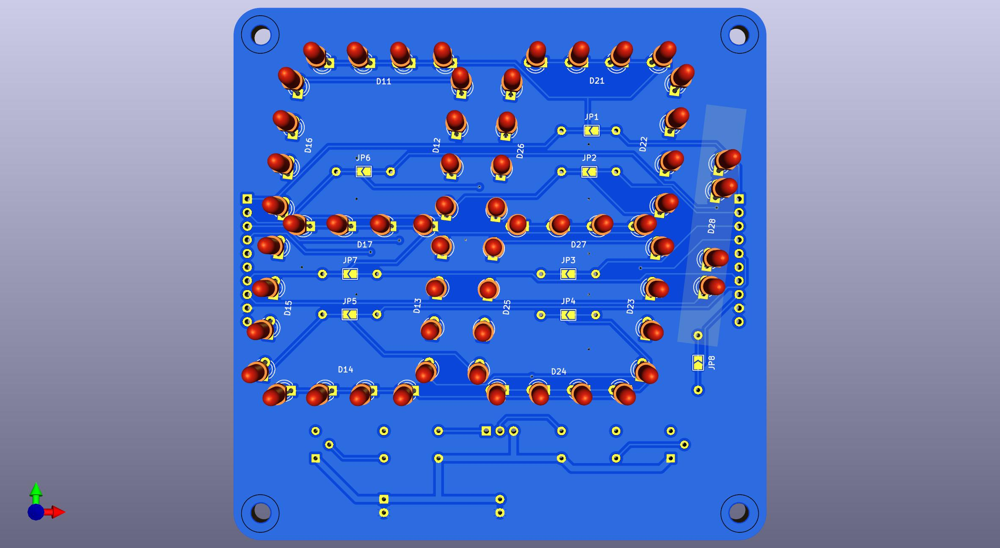

# 7 segment 2 digit board

These are the design files for a 7 segment board similar to [6 segment 2 digit board](https://hackaday.io/project/175397-6-segment-2-digit-led-board).

This is a multiplexed design with 7 cathode segment drive lines plus 1 colon line. The cathode drive lines are taken low to turn on the LEDs, while the anode drive lines are taken low to turn on the transistors.

## Versioning

Release March 2025

## Notes

Most components are installed on the back side and the LEDs are installed on the front side.

The PNP transistors need a gain > 40. A bit more margin is recommended.

Note the the LED supply voltage will need to be higher than 4x the LED drop and the cathode current limiting resistor should be calculated accordingly. So 5V will not be sufficient and also a buffer stage will be needed for most MCUs. For example with a 12V supply and green (not emerald) LEDs, the voltage drop per LED is 2V. The transistor drops will be around 0.8V. That leaves 2.2V to be dropped across the resistor. A 220Ω resistor gives 10mA through the LED. For 4 digits multiplexed this is effectively 2.5mA. Modern LEDs are efficient enough to shine brightly at such currents. For dimming, use PWM.

When cascading only the rightmost board needs to be fully populated. The others need only the LEDs, the anode driver transistors, and its resistors. The cathode resistors are not installed and the solder jumpers are closed.

## Authors

* **Ken Yap**

## License

See the [LICENSE](LICENSE.md) file for license rights and limitations (MIT).
